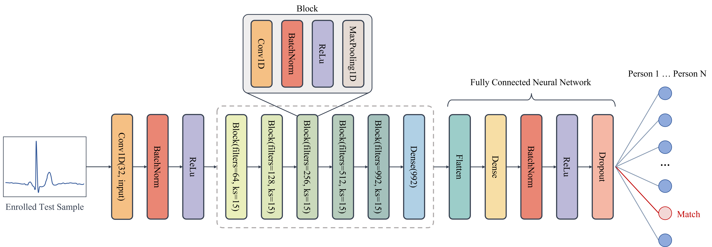
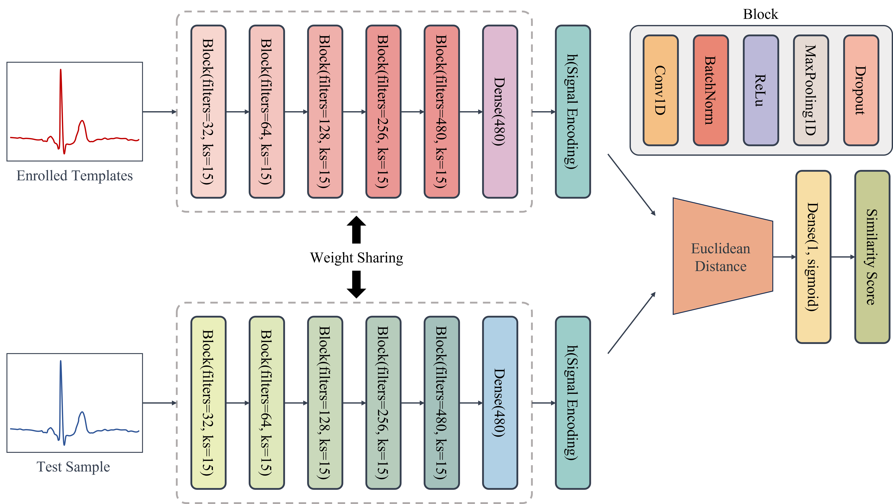
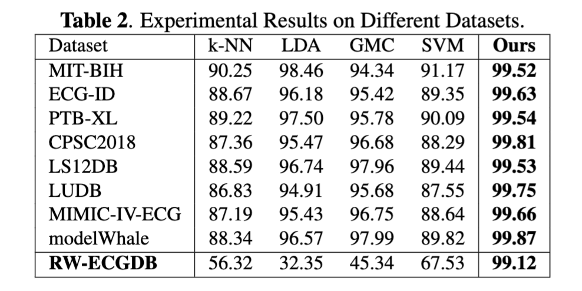

# BioAuECG
BioAuECG: Biometric Authentication using Electrocardiogram, source code

Colab demo is coming soon!

## Framework
### System Framework
**Enrollment Phase**: Involves signal acquisition, feature extraction focusing on QRS wave clusters, and preparation for training the verification and authentication models.

**Verification Methodology**: Utilizes a concatenated neural network for matching test signals to registered templates based on Euclidean distance.

**Authentication Process**: Employs a closed set multiple classification CNN for verifying matched test signals.

Illustrates the Convolution Neural Network Architecture.



Illustrates the Siamese Neural Network Architecture.



## Experiments
### Public Datasets
To evaluate performance under realistic conditions with a relevant number of users and optimal continuous recording time, we selected the MIT-BIH, ECG-ID, PTB-XL, The China Physiological Signal Challenge 2018 (CPSC2018), A large scale 12-lead ECG database for arrhythmia study (LS12DB), Lobachevsky University ECG Database (LUDB), MIMIC-IV-ECG and modelWhale public datasets from PhysioNet.



### Private Datasets: Real World ECG Dataset (RW-ECGDB)
We collected single-lead ECG data from 17 individuals during three days of activity, sampled at 512 Hz. These three days included ECG data from numerous exercises (including cycling, swimming, running, walking, sitting, lying down, etc.)

We have added extensive discussion and experiments in the new version of the paper on "Addressing the depth of potential challenges specific to ECG data, such as signal variability due to physiological or environmental factors", and the experimental results show that our approach can be effectively applied to heart rate authentication in a variety of states (running as well as resting). The paper will be published in the final paper If the paper is accepted, we will present it in the final paper. 

We have performed tests on datasets collected in real environments, and the relevant datasets will be updated in github after the paper is accepted. We have tested on these datasets and found that our method is still able to maintain a recognition accuracy of over 99%. And it was found that a significant decrease in the correctness of the traditional method occurred on this dataset. The dataset RW-ECGDB will be publicly available in the github repository after the paper is accepted.

## How to Run
Python 3.9.13 & ubuntu 20.04.1
```
$ conda create -n bioauecg python=3.9
$ conda activate bioauecg
$ pip install -r requirements.txt
```


Once the data is fully set up, run the following commands to extract signals into readable **csv** file formats
```shell
$ python3 run.py -s-mit
$ python3 run.py -s-ecgid
$ python3 run.py -s-bmd
```

For Feature Extraction, run. ECG segments of size 256 will be saved into the folder **root_folder/BioAuECG/data/ready/signals/** in pickle format
```
$ python3 run.py -f-mit
$ python3 run.py -f-ecgid
$ python3 run.py -f-bmd
```

Set up data for Training, Only MIT-BIH is selected. Two pickle files 'cnn.pickle' for CNN and 'snn.pickle' for SNN model development will be created in the folder **root_folder/BioAuECG/data/ready/pickles/**
```
$ python3 run.py -setup
```

Train the SNN model. A model will be saved in Keras `model.save()` format into the folder **root_folder/BioAuECG/models/snn/** and all plots will be saved under **root_folder/BioAuECG/media/plots/**
```
$ python3 run.py -snn
```

Train the CNN model. A model will be saved in Keras `model.save()` format into the folder **root_folder/BioAuECG/models/cnn/** and all plots will be saved under **root_folder/BioAuECG/media/plots/**
```
$ python3 run.py -cnn
```


### To Do List
🔘1. Colab online running demo

🔘2. Publish the collected ECG datasets in real environments (including ECG in various motion states and at rest).


```

# License
This code and model are available only for non-commercial research purposes as defined in the LICENSE (i.e., MIT LICENSE). 
[Check the LICENSE](./LICENSE)
